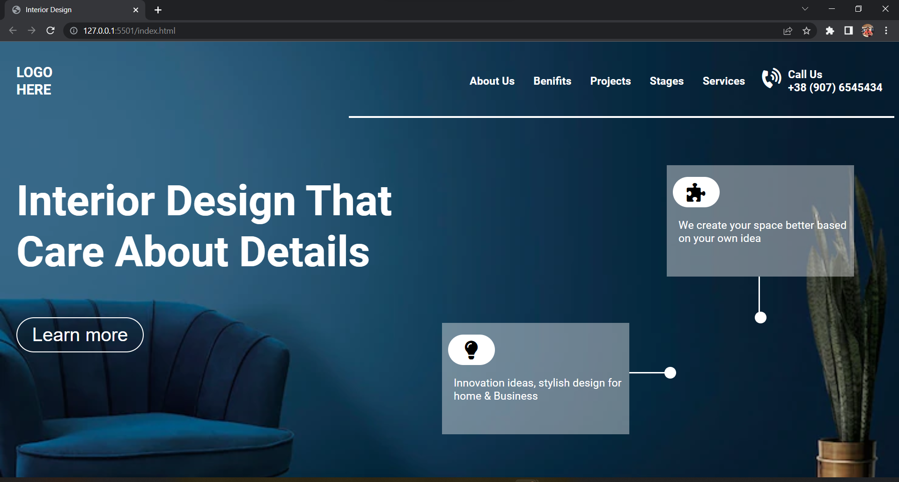
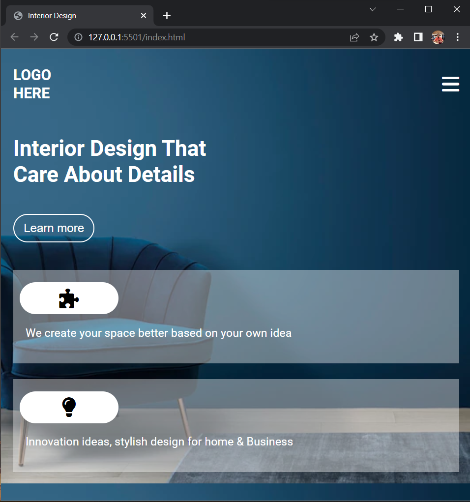

# Project 10
### Interior Designing Landing Page

***
## Check the live website [here](https://interior-design-p-10.netlify.app/ "netlify")
***
## My learnings
1. Learned and implemented media queries.
2. Learned and implemented mobile first design.
3. Learned how to provide the box background and given it to two boxes.
4. Implimanted the fa icons in the CSS.

### Outputs
 
 ### Mobile responsive
 ***
 